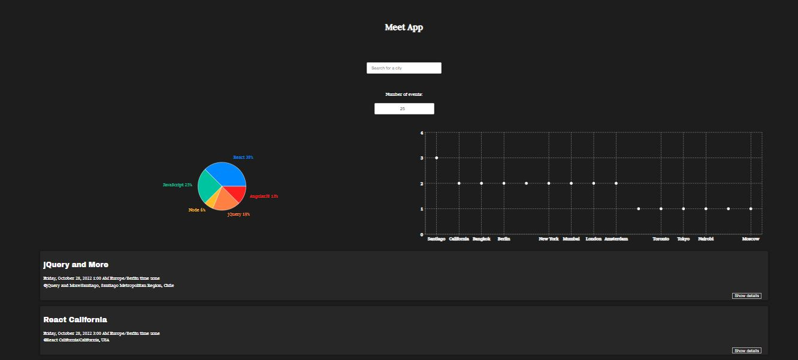

# meetup App

## Description

A serverless, progressive web application (PWA) with React using a test-driven development (TDD) technique. The application uses the Google Calendar API to fetch upcoming events.

## About the project meetup(features, user stories and scenarios)

### FEATURE 1: FILTER EVENTS BY CITY

### USER STORY: As a user, I would like to be able to filter events by city so that I can see the list of events that take place in that city.

SCENARIO 1: WHEN USER HASN’T SEARCHED FOR A CITY, SHOW UPCOMING EVENTS FROM ALL CITIES.
GIVEN user hasn’t searched for any city, WHEN the user opens the app, THEN the user should see a list of all upcoming events

SCENARIO 2: USER SHOULD SEE A LIST OF SUGGESTIONS WHEN THEY SEARCH FOR A CITY.
GIVEN the main page is open, WHEN user starts typing in the city textbox, ThEN the user should see a list of cities (suggestions) that match what they’ve typed

SCENARIO 3: USER CAN SELECT A CITY FROM THE SUGGESTED LIST.
GIVEN the user was typing “Berlin” in the city textbox. And the list of suggested cities is showing, WHEN the user selects a city (e.g., “Berlin, Germany”) from the list,THEN their city should be changed to that city (i.e., “Berlin, Germany”).And the user should receive a list of upcoming events in that city

### FEATURE 2: SHOW/HIDE AN EVENT'S DETAILS

### USER STORY: As a user I should be able to show/hide the details of an event so that I will able the see the details of only the event I am interested in.

SCENARIO 1: AN EVENT ELEMENT IS COLLAPSED BY DEFAULT
GIVEN the user is on another page, WHEN the user opens the events page, THEN the event’s details will all be collapsed.

SCENARIO 2: USER CAN EXPAND AN EVENT TO SEE ITS DETAILS
GIVEN user hasn’t yet expanded an event’s detail, WHEN user clicks a button, THEN the event’s details will be expanded.

SCENARIO 3: USER CAN COLLAPSE AN EVENT TO HIDE ITS DETAILS
GIVEN the event’s details has been expanded, WHEN user clicks a button, THEN the details will be collapsed

### FEATURE 3: SPECIFY NUMBER OF EVENTS

### USER STORY: As a user, I should be able to specify the number of events I can view so that I can limit the number of events I view.

SCENARIO 1: WHEN USER HASN’T SPECIFIED A NUMBER, 32 IS THE DEFAULT NUMBER
GIVEN the user hasn’t specified the number of events, WHEN he/she opens the events page, THEN 32 events will be displayed by default.

SCENARIO 2: USER CAN CHANGE THE NUMBER OF EVENTS THEY WANT TO SEE
GIVEN the number of events displayed by defaultis 32, WHEN the user types in a number, THEN that specified number of events will be displayed.

### FEATURE 4: USE THE APP WHEN OFFLINE

### USER STORY: As a user, I should be able to use the app when I am offline, so that even when I am not connected to the internet and i can still view the events.

SCENARIO 1: SHOW CACHED DATA WHEN THERE’S NO INTERNET CONNECTION
GIVEN that the user is offline, WHEN he/she opens the app, THEN he/she can see the events he last viewed.

SCENARIO 2: SHOW ERROR WHEN USER CHANGES THE SETTINGS (CITY, TIME RANGE)
GIVEN the user is offline, WHEN the user changes the settings, THEN the app will display an error.

### FEATURE 5: DATA VISUALIZATION

### USER STORY: As a user, I should be able to visualise a chart of events in each city so that I can see the number and type of events by city.

SCENARIO 1: SHOW A CHART WITH THE NUMBER OF UPCOMING EVENTS IN EACH CITY
GIVEN the user is on the app, WHEN he navigates to the page containing the chart, THEN he should be able to see which events are organised by cities.

### FEATURE 6: ADD AN APP SHORTCUT TO THE HOME SCREEN.

### USER STORY: As a user, I would like to be able to add the app shortcut to my home screen so that I can open the app faster.

## Built With

- HTML,CSS & React
- Amazon web service Lambda functions, google calendar API
- Libraries(Jest, Enzyme, Cumcuber, Puppeteer,Recharts)

## Live Demo

[Live Demo Link](https://tabetommy.github.io/meetup/)

## Lessons learned

- I learnt about serverless functions and implemented one with Amazon web service to generate tokens to fetch data from google calendar API
- I also learnt about a test driven approach to developement and implemented Unit, Intergrated, User Acceptance and End-to-End testing
- I learnt and successively converted the app to a progresive web app by implementing a service worker and configuring the JSON manifest file.
- Finally, i used a Rechart Js to plot charts.

👤 **Author1**

- Github: [@githubhandle](https://github.com/tabetommy)
- Linkedin: [linkedin](https://www.linkedin.com/in/tommy-egbe-304464116/)

## 🤝 Contributing

Contributions, issues and feature requests are welcome!

Feel free to check the [issues page](issues/).

## Show your support

Give a ⭐️ if you like this project!
